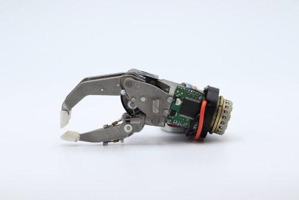
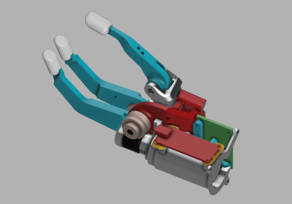

# MYO HAND

This repository contents the documentation of the ORTHOPUS' prosthetic myohand which is currently under development.

This new myoelectric prosthetic hand goes beyond the three-fingered  hands where the thumb faces the index and middle finger. Its specificity lies in the fact its thumb has flexion and abduction mobility. Thanks to the myoelectric sensors (called electromyography ) on his/her  residual arm, the user can control the prosthetic by simply contracting  his/her muscles.

The purpose of this prosthetic hand is to make  everyday life easier and extend the autonomy of upper-limb amputees by  helping them easily grip and handle objects with strength and precision.

## WARNING NOTICE BEFORE STARTING

The versions of our solutions reproduced in Do It Yourself do not have the CE marking. It can only be applied to solutions developed and sold by ORTHOPUS which follow the regulations in force.
ORTHOPUS cannot guarantee the “quality” of solutions replicated by third parties thanks to documentation shared on github.

## THIS SOLUTION IS UNDER DEVELOPMENT

**MyoHand is currently under development and provided code & CAD files can include mistakes and necessitate further improvements. The provided files are shared to provide a first overview of the project.**

*Click on the image to view the myohand in Fusion 360 viewer*

### About software : embedded source code release notes

Few details :
- IDE used : Atom + PlatformIO
- Target platform : Arduino Nano Every (Atmega4809)

### About hardware : mechanical design release notes

Please note that :
- the current version is using Alumunium 3D printing part to lower the development phase duration 
- cables are not represented (crimped cable ⌀1mm) 
- screws are not represented (M3 & M2 screws)
- others components may be missing to build an entire prototype
  

## CONTRIBUTION

Your contribution to these projects is welcome!

* Have you discovered a bug or you have an improvement ideas ?
  * Go to the GitHub [issues](https://github.com/orthopus/01-prosthetic-myo-hand/issues) of the project.
* You have time, some Maker skills and you want to help us ?
  * Read the [CONTRIBUTING](CONTRIBUTING.md) file to help us to upgrade this project
  * Read the [CODEOFCONDUCT](CODEOFCONDUCT.md) file to know community standards

## CONTACT

If you wish to contact us, you can send a message to contact@orthopus.com
